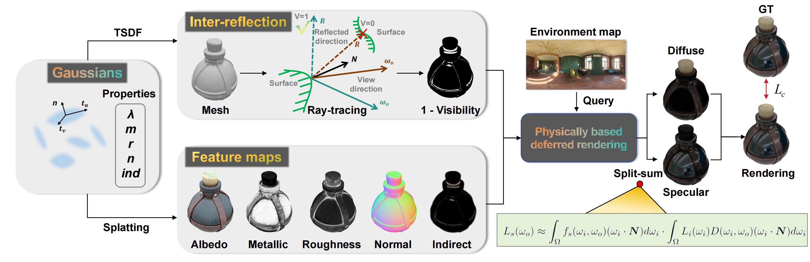

# Ref-Gaussian: Reflective Gaussian Splatting
### [[Project]](https://fudan-zvg.github.io/ref-gaussian) [[Paper]](https://arxiv.org/abs/2412.19282)

> [**Reflective Gaussian Splatting**](https://arxiv.org/abs/2412.19282),            
> [Yuxuan Yao](https://yaoyuxuanyyds.github.io/), Zixuan Zeng, [Chun Gu](https://sulvxiangxin.github.io/), [Xiatian Zhu](https://surrey-uplab.github.io/), [Li Zhang](https://lzrobots.github.io)  
> **ICLR 2025**

**Official implementation of "Reflective Gaussian Splatting".** 

## 🎥 Video

https://github.com/user-attachments/assets/99a9b449-f7b0-4db0-8f97-2ce5a5f5639d


## 🛠️ Pipeline
<div align="center">
  
</div><br/>


## 📜 BibTeX
```bibtex
@inproceedings{yao2025refGS,
  title={Reflective Gaussian Splatting},
  author={Yao, Yuxuan and Zeng, Zixuan and Gu, Chun and Zhu, Xiatian and Zhang, Li},
  booktitle={ICLR},
  year={2025},
}
```
